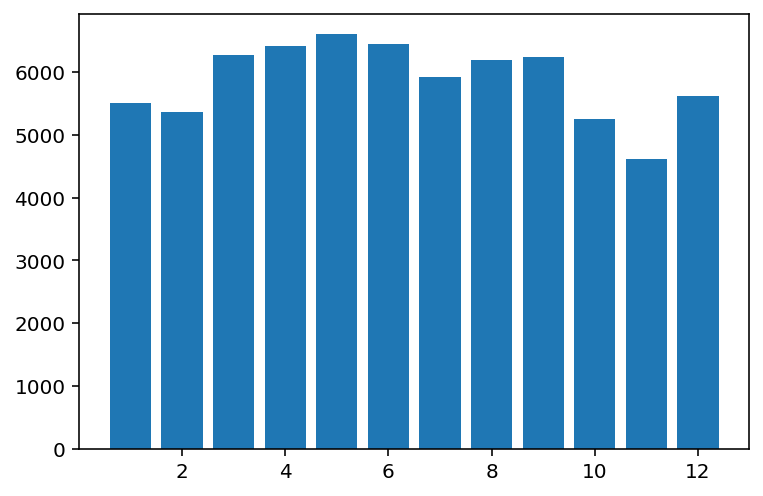
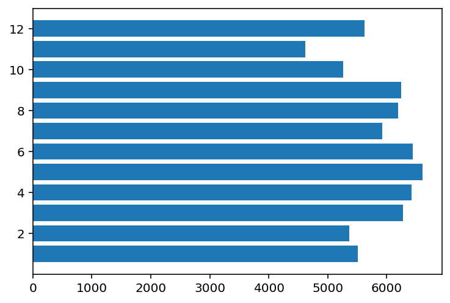
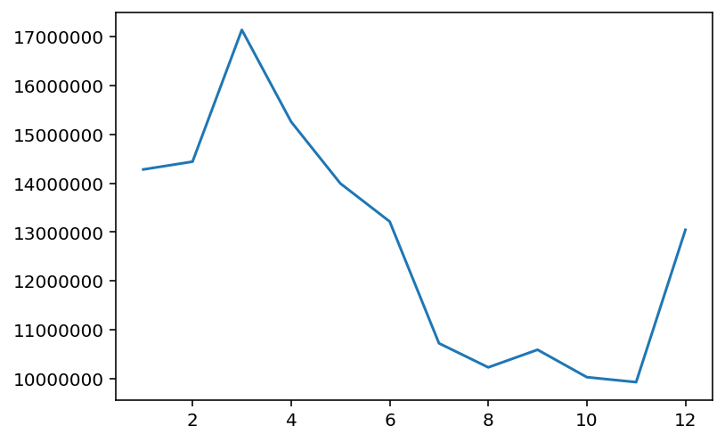
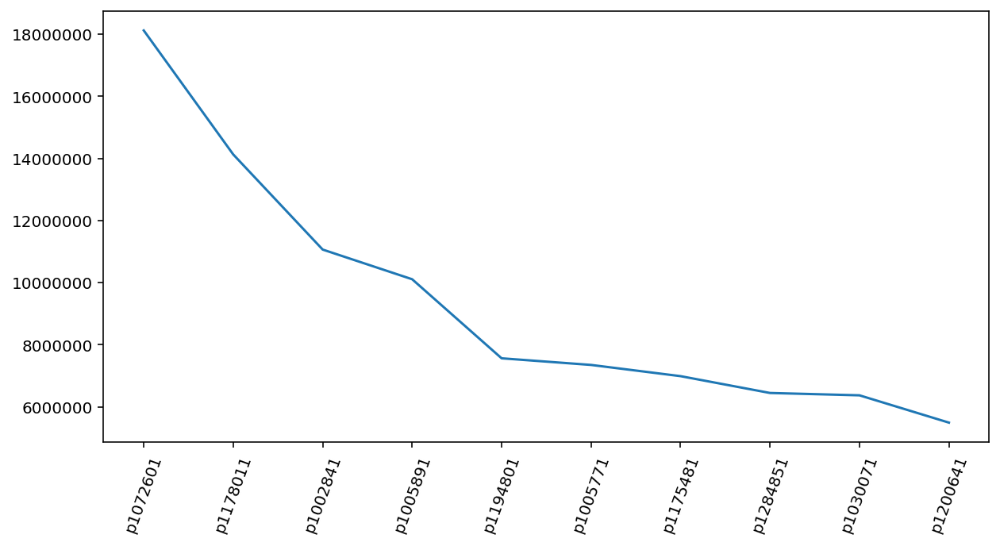

# 주피터 노트북 다루기

#### 1) 팩토리얼, 제곱근


```python
import math

math.factorial(7)
```


    5040


```python
from math import factorial
factorial(3)
```


    6


```python
from math import sqrt

sqrt(8)
```


    2.8284271247461903


#### 2) [심화] 주사위를 던져서 나온 숫자들의 총합을 구하는 코드
- 주사위를 던질 횟수를 받는 변수 count(숫자)
- count 만큼 주사위를 던져서 나온 모든 숫자들의 합 구해봅시다
- 주사위의 각 면에는 1~6까지의 눈이 새겨져 있고, 각숫자는 무작위로 나옵니다(radient)
- 주사위를 던져 나온 수들을 리스트렝 저장하고, sum 함수를 이용해봅시다


```python
import random

count = 10
nums = []
total = 0

for i in range(count):
    n = random.randint(1,6)
    total += n
    print(n)
    
print(total)
```

    5
    5
    5
    3
    6
    2
    5
    4
    1
    4
    40
    

#### [심화2] 주사위 2개를 한꺼번에 던져서 나온 두 숫자의 합을 구하고, 이를 여러번 시행했을때의 평균값을 구해라
- count, randint, n번 시행후 두 숫자합의 평균


```python
count = int(input())
dice = []
for i in range(count):
    n1 = random.randint(1,6)
    n2 = random.randint(1,6)
    dice.append(n1+n2)
print(dice)
print(sum(dice)/count)
```

    5
    [8, 10, 7, 4, 8]
    7.4
    

#### ※ 함수만들기


```python
def calculate1(na, nb, operator) :
    if operator == '+' :
        result = na + nb
    elif operator == '-' :
        result = na - nb
    elif operator == '*' :
        result = na * nb
    else :
        result = na / nb
    print(result)
calculate1(4, 2, '*')
```

    8
    


```python
r = calculate1(216, 6, '/')
r
```

    36.0
    

#### [심화] 복리계산기 함수 interest를 만들어 보자
- 입력변수 : 예금액, 이자, 연수
- 결과 : 복리로 불어난 예금액


```python
def interest(deposit, rate, years) :
    balance = deposit
    
    for i in range(1,years) :
        
        balance *= (1+rate)
        
    return balance

result = interest(120000, 0.05, 5)

print(result)
```

    145860.75
    

#### 데이터 탐색 기초


```python
import pandas as pd
path = 'https://bit.ly/TipsFile'
tip = pd.read_csv(path)
print(tip.head(10))
```

       total_bill   tip     sex smoker  day    time  size
    0       16.99  1.01  Female     No  Sun  Dinner     2
    1       10.34  1.66    Male     No  Sun  Dinner     3
    2       21.01  3.50    Male     No  Sun  Dinner     3
    3       23.68  3.31    Male     No  Sun  Dinner     2
    4       24.59  3.61  Female     No  Sun  Dinner     4
    5       25.29  4.71    Male     No  Sun  Dinner     4
    6        8.77  2.00    Male     No  Sun  Dinner     2
    7       26.88  3.12    Male     No  Sun  Dinner     4
    8       15.04  1.96    Male     No  Sun  Dinner     2
    9       14.78  3.23    Male     No  Sun  Dinner     2
    


```python
# shape 사용
print('***shape***')
print(tip.shape)

# dtypes : 데이터의 속성을 보여준다.
print('***dtypes***')
print(tip.dtypes)

# info : 기본정보
print('***dtypes***')
print(tip.info())

# describe : 기초통계정보
print('***describe***')
print(tip.describe())
```

    ***shape***
    (244, 7)
    ***dtypes***
    total_bill    float64
    tip           float64
    sex            object
    smoker         object
    day            object
    time           object
    size            int64
    dtype: object
    ***dtypes***
    <class 'pandas.core.frame.DataFrame'>
    RangeIndex: 244 entries, 0 to 243
    Data columns (total 7 columns):
     #   Column      Non-Null Count  Dtype  
    ---  ------      --------------  -----  
     0   total_bill  244 non-null    float64
     1   tip         244 non-null    float64
     2   sex         244 non-null    object 
     3   smoker      244 non-null    object 
     4   day         244 non-null    object 
     5   time        244 non-null    object 
     6   size        244 non-null    int64  
    dtypes: float64(2), int64(1), object(4)
    memory usage: 13.5+ KB
    None
    ***describe***
           total_bill         tip        size
    count  244.000000  244.000000  244.000000
    mean    19.785943    2.998279    2.569672
    std      8.902412    1.383638    0.951100
    min      3.070000    1.000000    1.000000
    25%     13.347500    2.000000    2.000000
    50%     17.795000    2.900000    2.000000
    75%     24.127500    3.562500    3.000000
    max     50.810000   10.000000    6.000000
    


```python
# value_counts() 'day' , 'time' 고유값과 개수 확인하는거
print(tip['day'].value_counts())
print(tip['time'].value_counts())
print('--------------------')
print(tip[['day', 'time']].value_counts())

print('--------------------')

#최대값 한번에 확인
print(tip[['total_bill','tip']].max())
```

    Sat     87
    Sun     76
    Thur    62
    Fri     19
    Name: day, dtype: int64
    Dinner    176
    Lunch      68
    Name: time, dtype: int64
    --------------------
    day   time  
    Sat   Dinner    87
    Sun   Dinner    76
    Thur  Lunch     61
    Fri   Dinner    12
          Lunch      7
    Thur  Dinner     1
    dtype: int64
    --------------------
    total_bill    50.81
    tip           10.00
    dtype: float64
    

#### 정렬(오름차순, 내림차순)

- 1. total_bill 열을 기준으로 내림차순으로 상위 10개를 tip_top10 선언
- 2. tip_top10 인덱스 초기화


```python
tip_top10 = tip.sort_values(by='total_bill', ascending=False).head(10)
tip_top10.reset_index(drop=True, inplace=True)
tip_top10
```


<div>
<style scoped>
    .dataframe tbody tr th:only-of-type {
        vertical-align: middle;
    }

    .dataframe tbody tr th {
        vertical-align: top;
    }

    .dataframe thead th {
        text-align: right;
    }
</style>
<table border="1" class="dataframe">
  <thead>
    <tr style="text-align: right;">
      <th></th>
      <th>total_bill</th>
      <th>tip</th>
      <th>sex</th>
      <th>smoker</th>
      <th>day</th>
      <th>time</th>
      <th>size</th>
    </tr>
  </thead>
  <tbody>
    <tr>
      <th>0</th>
      <td>50.81</td>
      <td>10.00</td>
      <td>Male</td>
      <td>Yes</td>
      <td>Sat</td>
      <td>Dinner</td>
      <td>3</td>
    </tr>
    <tr>
      <th>1</th>
      <td>48.33</td>
      <td>9.00</td>
      <td>Male</td>
      <td>No</td>
      <td>Sat</td>
      <td>Dinner</td>
      <td>4</td>
    </tr>
    <tr>
      <th>2</th>
      <td>48.27</td>
      <td>6.73</td>
      <td>Male</td>
      <td>No</td>
      <td>Sat</td>
      <td>Dinner</td>
      <td>4</td>
    </tr>
    <tr>
      <th>3</th>
      <td>48.17</td>
      <td>5.00</td>
      <td>Male</td>
      <td>No</td>
      <td>Sun</td>
      <td>Dinner</td>
      <td>6</td>
    </tr>
    <tr>
      <th>4</th>
      <td>45.35</td>
      <td>3.50</td>
      <td>Male</td>
      <td>Yes</td>
      <td>Sun</td>
      <td>Dinner</td>
      <td>3</td>
    </tr>
    <tr>
      <th>5</th>
      <td>44.30</td>
      <td>2.50</td>
      <td>Female</td>
      <td>Yes</td>
      <td>Sat</td>
      <td>Dinner</td>
      <td>3</td>
    </tr>
    <tr>
      <th>6</th>
      <td>43.11</td>
      <td>5.00</td>
      <td>Female</td>
      <td>Yes</td>
      <td>Thur</td>
      <td>Lunch</td>
      <td>4</td>
    </tr>
    <tr>
      <th>7</th>
      <td>41.19</td>
      <td>5.00</td>
      <td>Male</td>
      <td>No</td>
      <td>Thur</td>
      <td>Lunch</td>
      <td>5</td>
    </tr>
    <tr>
      <th>8</th>
      <td>40.55</td>
      <td>3.00</td>
      <td>Male</td>
      <td>Yes</td>
      <td>Sun</td>
      <td>Dinner</td>
      <td>2</td>
    </tr>
    <tr>
      <th>9</th>
      <td>40.17</td>
      <td>4.73</td>
      <td>Male</td>
      <td>Yes</td>
      <td>Fri</td>
      <td>Dinner</td>
      <td>4</td>
    </tr>
  </tbody>
</table>
</div>


```python
import matplotlib.pyplot as plt
plt.bar(tip_top10.index, tip_top10['total_bill'])
plt.title('top10', fontsize=30)
plt.savefig('test.png') # 그림 저장
```


    

    


```python
# total_bill과 tip 열 확인후 top10개만
tip[['total_bill', 'tip']].head(10)
```


<div>
<style scoped>
    .dataframe tbody tr th:only-of-type {
        vertical-align: middle;
    }

    .dataframe tbody tr th {
        vertical-align: top;
    }

    .dataframe thead th {
        text-align: right;
    }
</style>
<table border="1" class="dataframe">
  <thead>
    <tr style="text-align: right;">
      <th></th>
      <th>total_bill</th>
      <th>tip</th>
    </tr>
  </thead>
  <tbody>
    <tr>
      <th>0</th>
      <td>16.99</td>
      <td>1.01</td>
    </tr>
    <tr>
      <th>1</th>
      <td>10.34</td>
      <td>1.66</td>
    </tr>
    <tr>
      <th>2</th>
      <td>21.01</td>
      <td>3.50</td>
    </tr>
    <tr>
      <th>3</th>
      <td>23.68</td>
      <td>3.31</td>
    </tr>
    <tr>
      <th>4</th>
      <td>24.59</td>
      <td>3.61</td>
    </tr>
    <tr>
      <th>5</th>
      <td>25.29</td>
      <td>4.71</td>
    </tr>
    <tr>
      <th>6</th>
      <td>8.77</td>
      <td>2.00</td>
    </tr>
    <tr>
      <th>7</th>
      <td>26.88</td>
      <td>3.12</td>
    </tr>
    <tr>
      <th>8</th>
      <td>15.04</td>
      <td>1.96</td>
    </tr>
    <tr>
      <th>9</th>
      <td>14.78</td>
      <td>3.23</td>
    </tr>
  </tbody>
</table>
</div>


```python
good = tip[(tip['total_bill']>=45) & (tip['tip']>=6)]
good.reset_index(drop=True, inplace=True)
good
```


<div>
<style scoped>
    .dataframe tbody tr th:only-of-type {
        vertical-align: middle;
    }

    .dataframe tbody tr th {
        vertical-align: top;
    }

    .dataframe thead th {
        text-align: right;
    }
</style>
<table border="1" class="dataframe">
  <thead>
    <tr style="text-align: right;">
      <th></th>
      <th>total_bill</th>
      <th>tip</th>
      <th>sex</th>
      <th>smoker</th>
      <th>day</th>
      <th>time</th>
      <th>size</th>
    </tr>
  </thead>
  <tbody>
    <tr>
      <th>0</th>
      <td>48.27</td>
      <td>6.73</td>
      <td>Male</td>
      <td>No</td>
      <td>Sat</td>
      <td>Dinner</td>
      <td>4</td>
    </tr>
    <tr>
      <th>1</th>
      <td>50.81</td>
      <td>10.00</td>
      <td>Male</td>
      <td>Yes</td>
      <td>Sat</td>
      <td>Dinner</td>
      <td>3</td>
    </tr>
    <tr>
      <th>2</th>
      <td>48.33</td>
      <td>9.00</td>
      <td>Male</td>
      <td>No</td>
      <td>Sat</td>
      <td>Dinner</td>
      <td>4</td>
    </tr>
  </tbody>
</table>
</div>


```python
good2 = tip[tip['total_bill']>=tip['total_bill'].mean()]
good2
```


<div>
<style scoped>
    .dataframe tbody tr th:only-of-type {
        vertical-align: middle;
    }

    .dataframe tbody tr th {
        vertical-align: top;
    }

    .dataframe thead th {
        text-align: right;
    }
</style>
<table border="1" class="dataframe">
  <thead>
    <tr style="text-align: right;">
      <th></th>
      <th>total_bill</th>
      <th>tip</th>
      <th>sex</th>
      <th>smoker</th>
      <th>day</th>
      <th>time</th>
      <th>size</th>
    </tr>
  </thead>
  <tbody>
    <tr>
      <th>2</th>
      <td>21.01</td>
      <td>3.50</td>
      <td>Male</td>
      <td>No</td>
      <td>Sun</td>
      <td>Dinner</td>
      <td>3</td>
    </tr>
    <tr>
      <th>3</th>
      <td>23.68</td>
      <td>3.31</td>
      <td>Male</td>
      <td>No</td>
      <td>Sun</td>
      <td>Dinner</td>
      <td>2</td>
    </tr>
    <tr>
      <th>4</th>
      <td>24.59</td>
      <td>3.61</td>
      <td>Female</td>
      <td>No</td>
      <td>Sun</td>
      <td>Dinner</td>
      <td>4</td>
    </tr>
    <tr>
      <th>5</th>
      <td>25.29</td>
      <td>4.71</td>
      <td>Male</td>
      <td>No</td>
      <td>Sun</td>
      <td>Dinner</td>
      <td>4</td>
    </tr>
    <tr>
      <th>7</th>
      <td>26.88</td>
      <td>3.12</td>
      <td>Male</td>
      <td>No</td>
      <td>Sun</td>
      <td>Dinner</td>
      <td>4</td>
    </tr>
    <tr>
      <th>...</th>
      <td>...</td>
      <td>...</td>
      <td>...</td>
      <td>...</td>
      <td>...</td>
      <td>...</td>
      <td>...</td>
    </tr>
    <tr>
      <th>237</th>
      <td>32.83</td>
      <td>1.17</td>
      <td>Male</td>
      <td>Yes</td>
      <td>Sat</td>
      <td>Dinner</td>
      <td>2</td>
    </tr>
    <tr>
      <th>238</th>
      <td>35.83</td>
      <td>4.67</td>
      <td>Female</td>
      <td>No</td>
      <td>Sat</td>
      <td>Dinner</td>
      <td>3</td>
    </tr>
    <tr>
      <th>239</th>
      <td>29.03</td>
      <td>5.92</td>
      <td>Male</td>
      <td>No</td>
      <td>Sat</td>
      <td>Dinner</td>
      <td>3</td>
    </tr>
    <tr>
      <th>240</th>
      <td>27.18</td>
      <td>2.00</td>
      <td>Female</td>
      <td>Yes</td>
      <td>Sat</td>
      <td>Dinner</td>
      <td>2</td>
    </tr>
    <tr>
      <th>241</th>
      <td>22.67</td>
      <td>2.00</td>
      <td>Male</td>
      <td>Yes</td>
      <td>Sat</td>
      <td>Dinner</td>
      <td>2</td>
    </tr>
  </tbody>
</table>
<p>99 rows × 7 columns</p>
</div>


#### Graduate파일


```python
import pandas as pd
path = 'https://bit.ly/GraduateFile'
graduate = pd.read_csv(path)
```


```python
# gre의 중앙값
gre_median = graduate['gre'].median()
print(gre_median)
```

    580.0
    


```python
# rank, admit별 gpa평균을 집계 <<<groupby>>>
tmp = graduate.groupby(by=['rank','admit'], as_index=False)['gpa'].mean()
tmp
```


<div>
<style scoped>
    .dataframe tbody tr th:only-of-type {
        vertical-align: middle;
    }

    .dataframe tbody tr th {
        vertical-align: top;
    }

    .dataframe thead th {
        text-align: right;
    }
</style>
<table border="1" class="dataframe">
  <thead>
    <tr style="text-align: right;">
      <th></th>
      <th>rank</th>
      <th>admit</th>
      <th>gpa</th>
    </tr>
  </thead>
  <tbody>
    <tr>
      <th>0</th>
      <td>1</td>
      <td>0</td>
      <td>3.345714</td>
    </tr>
    <tr>
      <th>1</th>
      <td>1</td>
      <td>1</td>
      <td>3.544242</td>
    </tr>
    <tr>
      <th>2</th>
      <td>2</td>
      <td>0</td>
      <td>3.316598</td>
    </tr>
    <tr>
      <th>3</th>
      <td>2</td>
      <td>1</td>
      <td>3.442593</td>
    </tr>
    <tr>
      <th>4</th>
      <td>3</td>
      <td>0</td>
      <td>3.402258</td>
    </tr>
    <tr>
      <th>5</th>
      <td>3</td>
      <td>1</td>
      <td>3.534643</td>
    </tr>
    <tr>
      <th>6</th>
      <td>4</td>
      <td>0</td>
      <td>3.291455</td>
    </tr>
    <tr>
      <th>7</th>
      <td>4</td>
      <td>1</td>
      <td>3.441667</td>
    </tr>
  </tbody>
</table>
</div>


```python
# rank와 admit를 이용해서 랭크별 합격자 수(sum) 구하기
tmp = graduate.groupby(by='rank', as_index = False)['admit'].sum()

import matplotlib.pyplot as plt

plt.bar(tmp['rank'],tmp['admit'])

plt.savefig('test.png')
```


    

    


```python
# rank와 admit를 이용해서 랭크별 합격율(mean) 구하기
tmp = graduate.groupby(by='rank', as_index = False)['admit'].mean()
import matplotlib.pyplot as plt
plt.bar(tmp['rank'],tmp['admit'])
# plt.savefig('test.png')
```


    <BarContainer object of 4 artists>


    

    


#### 가로 막대 버전


```python
# 추가로 가로막대 버전 rank와 admit를 이용해서 랭크별 합격자 수(sum) 구하기
tmp = graduate.groupby(by='rank', as_index = False)['admit'].sum()
import matplotlib.pyplot as plt
plt.barh(tmp['rank'],tmp['admit'])
# plt.savefig('test.png')
```


    <BarContainer object of 4 artists>


    

    


#### 전처리 기술


```python
import numpy as np
import pandas as pd
import matplotlib.pyplot as plt

# 차트 고해상도 하는 법
%config InlineBackend.figure_format = 'retina'
```


```python
# 파일 읽어오기
path = 'https://raw.githubusercontent.com/Jangrae/csv/master/orders_sample.csv'
orders = pd.read_csv(path)

# 데이터 확인
orders.head()
```


<div>
<style scoped>
    .dataframe tbody tr th:only-of-type {
        vertical-align: middle;
    }

    .dataframe tbody tr th {
        vertical-align: top;
    }

    .dataframe thead th {
        text-align: right;
    }
</style>
<table border="1" class="dataframe">
  <thead>
    <tr style="text-align: right;">
      <th></th>
      <th>order_date</th>
      <th>product</th>
      <th>quantity</th>
      <th>amount</th>
    </tr>
  </thead>
  <tbody>
    <tr>
      <th>0</th>
      <td>2019-01-02</td>
      <td>p1030071</td>
      <td>2</td>
      <td>7900</td>
    </tr>
    <tr>
      <th>1</th>
      <td>2019-01-02</td>
      <td>p1012761</td>
      <td>1</td>
      <td>1700</td>
    </tr>
    <tr>
      <th>2</th>
      <td>2019-01-02</td>
      <td>p1012581</td>
      <td>1</td>
      <td>1000</td>
    </tr>
    <tr>
      <th>3</th>
      <td>2019-01-02</td>
      <td>p1175481</td>
      <td>1</td>
      <td>1300</td>
    </tr>
    <tr>
      <th>4</th>
      <td>2019-01-02</td>
      <td>p1178011</td>
      <td>1</td>
      <td>8800</td>
    </tr>
  </tbody>
</table>
</div>


```python
# 날짜를 연월일로 나누기
print(orders['order_date'].str.split('-'))

year = orders['order_date'].str.split('-').str[0]
month = orders['order_date'].str.split('-').str[1]
day = orders['order_date'].str.split('-').str[2]

print(year.head())
print(month.head())
print(day.head())
```

    0        [2019, 01, 02]
    1        [2019, 01, 02]
    2        [2019, 01, 02]
    3        [2019, 01, 02]
    4        [2019, 01, 02]
                  ...      
    68834    [2020, 03, 31]
    68835    [2020, 03, 31]
    68836    [2020, 03, 31]
    68837    [2020, 03, 31]
    68838    [2020, 03, 31]
    Name: order_date, Length: 68839, dtype: object
    0    2019
    1    2019
    2    2019
    3    2019
    4    2019
    Name: order_date, dtype: object
    0    01
    1    01
    2    01
    3    01
    4    01
    Name: order_date, dtype: object
    0    02
    1    02
    2    02
    3    02
    4    02
    Name: order_date, dtype: object
    


```python
# year, month, day 추출 방법 #2  ----진짜 날짜로 바꾸는 타임 데이트타임
year = pd.to_datetime(orders['order_date']).dt.year
month = pd.to_datetime(orders['order_date']).dt.month
day = pd.to_datetime(orders['order_date']).dt.day
weekday = pd.to_datetime(orders['order_date']).dt.weekday  # 월:0~ 일:6

# 확인
print(year.head())
print(month.head())
print(day.head())
print(weekday.head()) #요일은 0이 월요일
```

    0    2019
    1    2019
    2    2019
    3    2019
    4    2019
    Name: order_date, dtype: int64
    0    1
    1    1
    2    1
    3    1
    4    1
    Name: order_date, dtype: int64
    0    2
    1    2
    2    2
    3    2
    4    2
    Name: order_date, dtype: int64
    0    2
    1    2
    2    2
    3    2
    4    2
    Name: order_date, dtype: int64
    


```python
# year, month, day 열 추가 하기
orders['year'] = pd.to_datetime(orders['order_date']).dt.year
orders['month'] = pd.to_datetime(orders['order_date']).dt.month
orders['weekday'] = pd.to_datetime(orders['order_date']).dt.weekday

orders.head()
```


<div>
<style scoped>
    .dataframe tbody tr th:only-of-type {
        vertical-align: middle;
    }

    .dataframe tbody tr th {
        vertical-align: top;
    }

    .dataframe thead th {
        text-align: right;
    }
</style>
<table border="1" class="dataframe">
  <thead>
    <tr style="text-align: right;">
      <th></th>
      <th>order_date</th>
      <th>product</th>
      <th>quantity</th>
      <th>amount</th>
      <th>year</th>
      <th>month</th>
      <th>weekday</th>
    </tr>
  </thead>
  <tbody>
    <tr>
      <th>0</th>
      <td>2019-01-02</td>
      <td>p1030071</td>
      <td>2</td>
      <td>7900</td>
      <td>2019</td>
      <td>1</td>
      <td>2</td>
    </tr>
    <tr>
      <th>1</th>
      <td>2019-01-02</td>
      <td>p1012761</td>
      <td>1</td>
      <td>1700</td>
      <td>2019</td>
      <td>1</td>
      <td>2</td>
    </tr>
    <tr>
      <th>2</th>
      <td>2019-01-02</td>
      <td>p1012581</td>
      <td>1</td>
      <td>1000</td>
      <td>2019</td>
      <td>1</td>
      <td>2</td>
    </tr>
    <tr>
      <th>3</th>
      <td>2019-01-02</td>
      <td>p1175481</td>
      <td>1</td>
      <td>1300</td>
      <td>2019</td>
      <td>1</td>
      <td>2</td>
    </tr>
    <tr>
      <th>4</th>
      <td>2019-01-02</td>
      <td>p1178011</td>
      <td>1</td>
      <td>8800</td>
      <td>2019</td>
      <td>1</td>
      <td>2</td>
    </tr>
  </tbody>
</table>
</div>


```python
# 요일 추가하기
orders['weekday'] = orders['weekday'].map({0:'mon',1:'tue',2:'wed',3:'thu',4:'fri',5:'sat',6:'sun'})

orders.head(10)
```


<div>
<style scoped>
    .dataframe tbody tr th:only-of-type {
        vertical-align: middle;
    }

    .dataframe tbody tr th {
        vertical-align: top;
    }

    .dataframe thead th {
        text-align: right;
    }
</style>
<table border="1" class="dataframe">
  <thead>
    <tr style="text-align: right;">
      <th></th>
      <th>order_date</th>
      <th>product</th>
      <th>quantity</th>
      <th>amount</th>
      <th>year</th>
      <th>month</th>
      <th>weekday</th>
    </tr>
  </thead>
  <tbody>
    <tr>
      <th>0</th>
      <td>2019-01-02</td>
      <td>p1030071</td>
      <td>2</td>
      <td>7900</td>
      <td>2019</td>
      <td>1</td>
      <td>wed</td>
    </tr>
    <tr>
      <th>1</th>
      <td>2019-01-02</td>
      <td>p1012761</td>
      <td>1</td>
      <td>1700</td>
      <td>2019</td>
      <td>1</td>
      <td>wed</td>
    </tr>
    <tr>
      <th>2</th>
      <td>2019-01-02</td>
      <td>p1012581</td>
      <td>1</td>
      <td>1000</td>
      <td>2019</td>
      <td>1</td>
      <td>wed</td>
    </tr>
    <tr>
      <th>3</th>
      <td>2019-01-02</td>
      <td>p1175481</td>
      <td>1</td>
      <td>1300</td>
      <td>2019</td>
      <td>1</td>
      <td>wed</td>
    </tr>
    <tr>
      <th>4</th>
      <td>2019-01-02</td>
      <td>p1178011</td>
      <td>1</td>
      <td>8800</td>
      <td>2019</td>
      <td>1</td>
      <td>wed</td>
    </tr>
    <tr>
      <th>5</th>
      <td>2019-01-02</td>
      <td>p1012751</td>
      <td>2</td>
      <td>2700</td>
      <td>2019</td>
      <td>1</td>
      <td>wed</td>
    </tr>
    <tr>
      <th>6</th>
      <td>2019-01-02</td>
      <td>p1097821</td>
      <td>1</td>
      <td>1000</td>
      <td>2019</td>
      <td>1</td>
      <td>wed</td>
    </tr>
    <tr>
      <th>7</th>
      <td>2019-01-02</td>
      <td>p1178011</td>
      <td>1</td>
      <td>8800</td>
      <td>2019</td>
      <td>1</td>
      <td>wed</td>
    </tr>
    <tr>
      <th>8</th>
      <td>2019-01-02</td>
      <td>p1178011</td>
      <td>1</td>
      <td>8800</td>
      <td>2019</td>
      <td>1</td>
      <td>wed</td>
    </tr>
    <tr>
      <th>9</th>
      <td>2019-01-02</td>
      <td>p1194801</td>
      <td>1</td>
      <td>8200</td>
      <td>2019</td>
      <td>1</td>
      <td>wed</td>
    </tr>
  </tbody>
</table>
</div>


#### 조건 조회 및 시각화
- 2019년 월별 분석 집계


```python
tmp = orders[orders['year']==2019].groupby(by=['month'], as_index=False)[['quantity','amount']].sum()

tmp.head()
```


<div>
<style scoped>
    .dataframe tbody tr th:only-of-type {
        vertical-align: middle;
    }

    .dataframe tbody tr th {
        vertical-align: top;
    }

    .dataframe thead th {
        text-align: right;
    }
</style>
<table border="1" class="dataframe">
  <thead>
    <tr style="text-align: right;">
      <th></th>
      <th>month</th>
      <th>quantity</th>
      <th>amount</th>
    </tr>
  </thead>
  <tbody>
    <tr>
      <th>0</th>
      <td>1</td>
      <td>5505</td>
      <td>14280112</td>
    </tr>
    <tr>
      <th>1</th>
      <td>2</td>
      <td>5369</td>
      <td>14439692</td>
    </tr>
    <tr>
      <th>2</th>
      <td>3</td>
      <td>6275</td>
      <td>17135535</td>
    </tr>
    <tr>
      <th>3</th>
      <td>4</td>
      <td>6424</td>
      <td>15256018</td>
    </tr>
    <tr>
      <th>4</th>
      <td>5</td>
      <td>6603</td>
      <td>13992944</td>
    </tr>
  </tbody>
</table>
</div>


```python
# 막대 그래프 시각화
plt.bar(tmp['month'],tmp['quantity'])

plt.show()
```


    

    


```python
plt.barh(tmp['month'],tmp['quantity'])

plt.show()
```


    

    


```python
# 선그래프

tmp['month'] = tmp['month'].astype(int)
tmp = tmp.sort_values(by='month', ascending=True)

# 시각화
plt.plot(tmp['month'], tmp['amount'])
plt.ticklabel_format(axis='y', style='plain') 
plt.show()
```


    

    


#### 축 값 제어하는 법
- 상품별 판매 현황을 집계하고 판매금액 기준 top10을 추출


```python
tmp = orders.groupby(by='product', as_index=False)[['quantity','amount']].sum()
tmp = tmp.sort_values(by='amount', ascending=False).head(10)

# ascending=False 내림차순

tmp
```


<div>
<style scoped>
    .dataframe tbody tr th:only-of-type {
        vertical-align: middle;
    }

    .dataframe tbody tr th {
        vertical-align: top;
    }

    .dataframe thead th {
        text-align: right;
    }
</style>
<table border="1" class="dataframe">
  <thead>
    <tr style="text-align: right;">
      <th></th>
      <th>product</th>
      <th>quantity</th>
      <th>amount</th>
    </tr>
  </thead>
  <tbody>
    <tr>
      <th>22</th>
      <td>p1072601</td>
      <td>4057</td>
      <td>18122113</td>
    </tr>
    <tr>
      <th>43</th>
      <td>p1178011</td>
      <td>1659</td>
      <td>14129078</td>
    </tr>
    <tr>
      <th>1</th>
      <td>p1002841</td>
      <td>907</td>
      <td>11064509</td>
    </tr>
    <tr>
      <th>4</th>
      <td>p1005891</td>
      <td>5189</td>
      <td>10108897</td>
    </tr>
    <tr>
      <th>46</th>
      <td>p1194801</td>
      <td>996</td>
      <td>7562421</td>
    </tr>
    <tr>
      <th>3</th>
      <td>p1005771</td>
      <td>3979</td>
      <td>7348918</td>
    </tr>
    <tr>
      <th>42</th>
      <td>p1175481</td>
      <td>5450</td>
      <td>6987517</td>
    </tr>
    <tr>
      <th>60</th>
      <td>p1284851</td>
      <td>2353</td>
      <td>6445713</td>
    </tr>
    <tr>
      <th>18</th>
      <td>p1030071</td>
      <td>1751</td>
      <td>6369971</td>
    </tr>
    <tr>
      <th>47</th>
      <td>p1200641</td>
      <td>787</td>
      <td>5490530</td>
    </tr>
  </tbody>
</table>
</div>


```python
# 시각화
plt.figure(figsize=(10, 5)) #1번째 방법 늘린다
plt.plot(tmp['product'], tmp['amount']) #가로축 앞에, 세로축 뒤에
plt.ticklabel_format(axis='y', style='plain')
plt.xticks(rotation=70) #2번째 방법 70도로 기울여라
plt.show()
```


    

    


```python

```


```python

```
